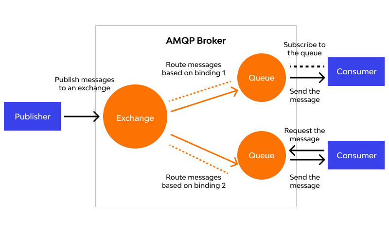

We'll go over RabbitMQ very briefly here.

I recommend taking an in depth look to their [github](https://github.com/rabbitmq/rabbitmq-server) and
[documentation](https://www.rabbitmq.com/docs) after reading this document.

RabbitMQ is an open-source message broker that facilitates communication between distributed systems by sending messages
between producers and consumers. Here’s a brief overview:

### **Key Concepts:**

  
  
<em>Advanced Message Queue Protocol</em>

1. **Broker**: RabbitMQ acts as an intermediary that accepts, stores, and forwards messages between different parts of a
   system.

2. **Producer**: The entity that sends messages to RabbitMQ.

3. **Queue**: A buffer that stores messages until they can be processed by a consumer. Messages are stored in queues
   until they are consumed.

4. **Consumer**: The entity that retrieves and processes messages from queues.

5. **Exchange**: Routes messages to one or more queues based on routing rules. There are several types of exchanges:
    - **Direct Exchange**: Routes messages with a specific routing key.
    - **Fanout Exchange**: Routes messages to all queues bound to it, ignoring routing keys.
    - **Topic Exchange**: Routes messages to queues based on wildcard matches of routing keys.
    - **Headers Exchange**: Routes messages based on header attributes instead of routing keys.

6. **Binding**: The relationship between an exchange and a queue. It determines how messages are routed from exchanges
   to queues.

7. **Routing Key**: A label used by exchanges to route messages to the appropriate queues.

### **Features:**

- **Reliability**: Ensures messages are delivered reliably through features like message acknowledgments and
  persistence.
- **Scalability**: Can be scaled horizontally by clustering multiple RabbitMQ servers.
- **Management UI**: Provides a web-based management interface for monitoring and controlling RabbitMQ.
- **Plugins**: Extensible with various plugins for additional features, such as monitoring, tracing, and management.

### **Use Cases:**

- **Decoupling Services**: Enables microservices and distributed systems to communicate without being directly
  connected.
- **Load Balancing**: Distributes messages across multiple consumers to balance load.
- **Asynchronous Processing**: Allows for background processing of tasks, such as handling file uploads or sending
  emails.

RabbitMQ is popular in both small and large-scale applications due to its robustness and flexibility.