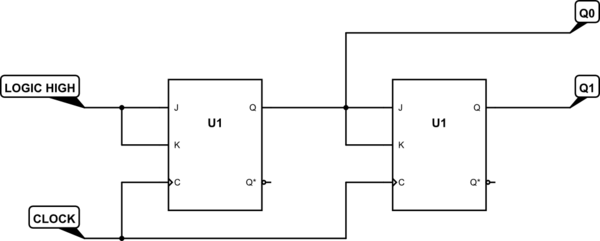
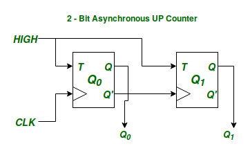

## Asynchronous Programming

#### **0. Introduction**

- **1.1 Definition of Asynchronous Programming**
    - Asynchronous programming is a form of parallel programming that allows a unit of work to run separately from the
      primary application thread and notifies the calling thread of its completion, failure, or progress.
    - Contrasts with synchronous programming where tasks are executed sequentially.

#### **1. Computer Architecture: Synchronous vs. Asynchronous Clocks/Circuits**

- **1.1 Synchronous Circuits**
    - Operate based on a global clock signal.
    - All parts of the circuit are coordinated by this clock, leading to predictable timing.
    - Easier to design and verify but can be less efficient in terms of power and speed.

  

- **1.2 Asynchronous Circuits**
    - Do not rely on a global clock signal.
    - Operations are triggered by data arrival, allowing parts of the circuit to run independently.
    - Potentially more efficient in terms of power and performance but harder to design and verify due to complex timing
      analysis.

  
- **1.3 usage in CPUs**
    - It's used in modern CPUs for special interfaces

#### **2. Importance of Asynchronous Programming**

- **2.1 Performance Improvement**
    - Enables non-blocking operations, improving application responsiveness.
- **2.2 Efficient Resource Utilization**
    - Allows better utilization of system resources by not idling on I/O operations.

#### **3. Core Concepts in Asynchronous Programming**

- **3.1 Tasks and Futures**
    - **Task:** A unit of work that is executed asynchronously.
    - **Future:** A placeholder object for a result that is initially unknown, usually because the computation of its
      value is yet to be completed.
- **3.2 Event Loop**
    - A programming construct that waits for and dispatches events or messages in a program.
    - Used in many asynchronous frameworks and libraries.
- **3.3 Callbacks**
    - Functions passed as arguments to other code that are invoked after a task completes.
- **3.4 Promises and Async/Await**
    - **Promise:** Represents a value that may be available now, or in the future, or never.
    - **Async/Await:** Syntax that allows writing asynchronous code in a synchronous manner.

#### **4. Asynchronous Programming Models**

- **4.1 Cooperative Multitasking**
    - Tasks voluntarily yield control periodically or when idle to let other tasks run.
- **4.2 Preemptive Multitasking**
    - System decides when to switch tasks, providing the illusion of concurrency.

#### **5. Asynchronous Programming in Different Languages**

- **5.1 JavaScript**
    - **Callbacks, Promises, Async/Await**
    - Example with Promises:
      ```javascript
      function fetchData() {
          return new Promise((resolve, reject) => {
              setTimeout(() => {
                  resolve("Data fetched");
              }, 2000);
          });
      }

      fetchData().then(data => console.log(data));
      ```

- **5.2 Python**
    - **asyncio, Async/Await**
    - Example with Async/Await:
      ```python
      import asyncio

      async def fetch_data():
          await asyncio.sleep(2)
          return "Data fetched"

      async def main():
          data = await fetch_data()
          print(data)

      asyncio.run(main())
      ```

#### **7. Challenges in Asynchronous Programming**

- **7.1 Debugging Complexity**
    - Difficult to trace bugs due to non-linear execution flow.
- **7.2 Error Handling**
    - Must handle errors carefully in callbacks, promises, or async functions.
- **7.3 State Management**
    - Maintaining and synchronizing state across different parts of an asynchronous application can be tricky.

#### **8. Best Practices**

- **8.1 Use Higher-Level Abstractions**
    - Utilize language or library abstractions to manage complexity.
- **8.2 Proper Error Handling**
    - Handle errors in asynchronous code to prevent crashes and undefined behavior.

#### **9. Practical Applications of Asynchronous Programming**

- **9.1 Web Development**
    - Handling I/O-bound operations like API calls or database queries without blocking the main thread.
- **9.2 User Interface Applications**
    - Keeping the UI responsive by offloading heavy computations to background threads.
- **9.3 Real-time Systems**
    - Managing real-time data streams and events efficiently.

#### **10. Conclusion**

- importance of asynchronous programming in modern software development.
- key concepts and best practices discussed.

| Category             | Synchronous            | Asynchronous            |
|----------------------|------------------------|-------------------------|
| Execution            | sequential             | concurrent with notifs  |
| Complexity           | simple                 | fairly complex concepts |
| Use case             | cpu/memory bound tasks | io bound tasks          |
